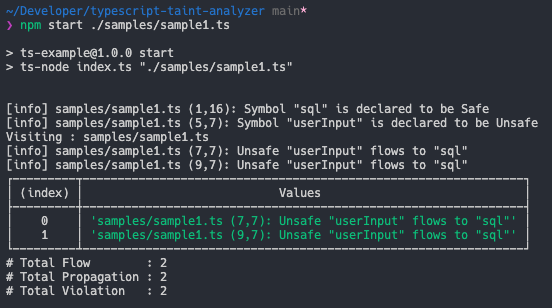

# TypeScript Taint Analyzer

정보보호학회 논문지 31권 2호 논문 "[정적 오염 분석을 활용한 타입스크립트 코드의 보안 취약점 탐지](http://journalhome2020-env.eba-bpefhmr2.ap-northeast-2.elasticbeanstalk.com/journals/jkiisc/digital-library/24602)"에서 사용한 Taint Analyzer.

## How does it work?

### 오염 분석(Taint Analysis)

오염 분석에서는 민감한 데이터가 유래하는 `source`와, 해당 데이터가 사용되는 `sink`를 정의해야 합니다.
- `source` : http 리퀘스트, DOM 인풋 등 **사용자 입력 값**이 들어있을 수 있는 변수.
- `sink` : sql query 함수, http 리스폰스 등 **검증되지 않은 사용자 입력 값**으로 인해 취약점이 발생할 수 있는 함수

### Proposed Technique

본 시스템에서는 [Symbol](https://basarat.gitbook.io/typescript/overview/binder#symbol) 정보를 바탕으로 데이터의 흐름을 분석합니다. (**주의** : JavaScript ES6 스펙의 Symbol과 다른 개념.)

심볼이 선언되는 위치 (e.x. 변수선언, 파라미터 선언)에 인라인 주석을 사용해 심볼의 안전성을 표기합니다.
- `/*@Unsafe*/` : 검증되지 않은 데이터임을 나타냄
- `/*@Safe*/` : 검증된 데이터임을 나타냄

정적 분석기를 통해 분석을 시작하면, 소스코드에 표기된 안전성 정보를 기반으로 `Unsafe` 데이터가 `Safe`로 흘러 들어가는 지점을 탐지합니다.

## How to Run

```bash
# Example
$ npm start TARGET_TYPESCRIPT_FILE
```

## Analysis Example

아래는 SQL Injection 취약점이 있는 웹 서버 코드를 간략히 표현한 것 입니다.

```typescript
function query(sql /*@Safe*/: string) {
    // do some query stuff here
}

const userInput /*@Unsafe*/ = 'some unsafe string';

query(userInput);

query(`select ${userInput} from db;`);

query(`select ${userInput} from db;` /*@Safe*/);
```

- 쿼리문을 실행하는 `query` 함수의 `sql` 파라미터는 `Safe`로 표시되어, 검증된 데이터만이 들어와야함을 나타냅니다어
- 검증되지 않은 사용자 입력값을 담고있는 `userInput` 변수는 `Unsafe`로 표시되어, 해당 데이터가 Safe로 흘러들어가는것을 탐지하게 됩니다.

### Analysis Result

